  

  

    
  

  

    <code><b>Backend • Go & Rust</b></code>
  

  _Entendiendo+el+hardware%2C+no+solo+el+framework.;>_La+memoria+no+se+regala%3A+se+gestiona.;>_El+tiempo+no+tiene+rollback.;>_Dise%C3%B1ado+para+resistir+cuando+todo+falle.;>_Menos+capas%2C+ingenier%C3%ADa+m%C3%A1s+honesta." alt="Terminal Typing" />

  

    <b>Desarrollador desde Colombia.</b> Lo que me mueve es sencillo: entender qué pasa por debajo de las capas, aprender cómo funciona el hardware y escribir código de calidad. Aprendí   rompiendo código en la terminal y leyendo logs. Construyo backend en <b>Go</b> y <b>Rust</b>   con foco en <b>rendimiento y estabilidad</b>.
  

 

  

    
    
    
    
  

 

---

### Stack Tecnologico

> Tecnologias con las que construyo activamente en mis proyectos, combinando practica continua, criterio de diseño e investigacion constante.

#### Sistemas, Backend & Persistencia

  

#### Diseño UX/UI, Frontend & Herramientas

  

 

---

  

